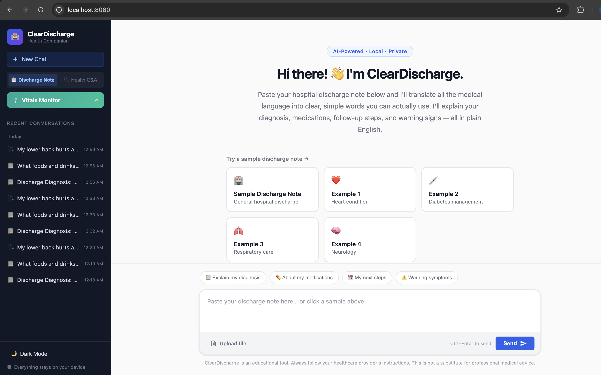
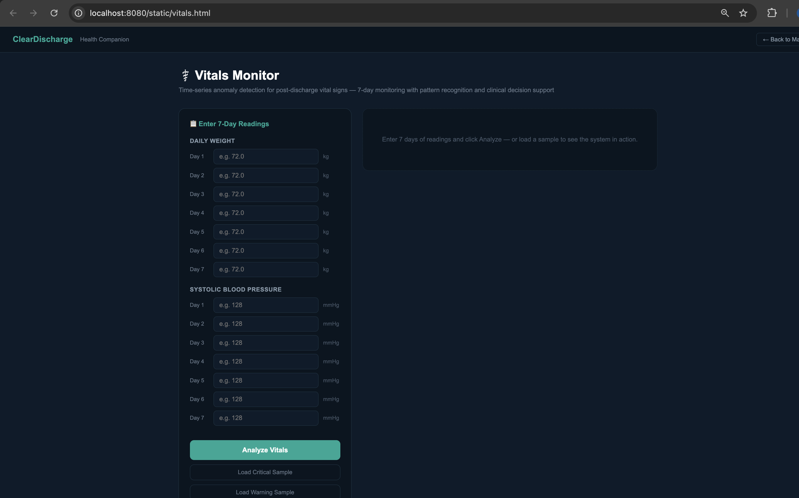

# ClearDischarge — Cotiviti Intern Assessment 2026

> A fully local, open-source RAG-based agentic AI system for hospital discharge comprehension and post-discharge vital sign monitoring. No cloud. No internet required. No patient data leaves the device.

**Author:** Fnu Ramyashree | **Assessment:** Cotiviti Intern | **Year:** 2026

---

## 📋 Topic
**Topic 2: Clinical Decision Making and Pattern Recognition in Health Care**
Agentic Generative AI for Treatment, Payment, and Operations (TPO)

---

## 📦 Deliverables
| File | Description |
|------|-------------|
| `ClearDischarge_Report_Ramyashree.docx` | 2-page written report + APA references |
| `ClearDischarge_Presentation_Ramyashree.pptx` | PowerPoint presentation |
| `Recording_zoom.mp4` | Video walkthrough and live demo |
| `src/`, `app/`, `static/` | Full POC source code |

---

## 🧠 What It Does

ClearDischarge has two modules:

### Module 1 — Discharge Note Explainer
Paste a hospital discharge note and get a plain-English explanation that any patient can understand. The system explains the diagnosis, medications, follow-up steps, and warning signs — all written at a 6th grade reading level.



Two new agentic panels appear with every response:
- 🤖 **Agentic Router** — shows which sections the system decided to retrieve and why
- ⚕️ **30-Day Readmission Risk** — predicts LOW / MEDIUM / HIGH risk from clinical signals in the note

### Module 2 — VitalPath: Post-Discharge Vitals Monitor
Enter 7 days of daily weight and blood pressure readings. The system runs z-score statistical analysis to detect anomalies, plots the trend, and classifies the pattern as STABLE, WARNING, or CRITICAL with a specific care recommendation.



---

## ⚙️ Agentic Features (Topic 2 Primitives)

| Function | Topic 2 Primitive | What It Does |
|----------|-------------------|--------------|
| `classify_intent()` | Classification | Labels any query as medication / follow_up / warning_sign / diagnosis / general |
| `route_query()` | Agentic Routing + Chain Reasoning | Decides which databases to search based on classification — never runs all 4 blindly |
| `score_readmission_risk()` | Prediction | Predicts 30-day readmission risk (LOW/MEDIUM/HIGH) from comorbidity signals |
| `detect_vitals_anomaly()` | Time-Series Anomaly Detection + Pattern Recognition | Detects dangerous patterns in 7-day post-discharge vital sign trends using z-score analysis |

---

## 🏗️ System Architecture

```
Discharge Note Input
        ↓
Preprocess & Expand Abbreviations (HFrEF → heart failure with reduced ejection fraction)
        ↓
classify_intent() — what type of query is this?
        ↓
route_query() — which sections do we need to search?
        ↓
Hybrid Retrieval — BM25 + PubMedBERT dense search via FAISS
        ↓
Plain-English Response + Agentic Router Panel + Risk Panel
```

**Knowledge Base:** 49,423 chunks from:
- FDA Drug Labels (openFDA)
- NIH MedlinePlus
- PubMed Abstracts
- PLABA Clinical Q&A Dataset

---

## 📊 Evaluation Results

| Metric | Score | What It Means |
|--------|-------|---------------|
| MRR | 0.576 | Right evidence in top 2 results on average |
| Recall@5 | 0.55 | 55% of correct answers in top 5 results |
| FK Grade Level | 9.3 | 3 grade levels more readable than raw clinical notes |
| Chunks Indexed | 49,423 | Across 4 open medical databases |

---

## 🚀 How to Run

```bash
# 1. Install dependencies
pip install -r requirements.txt

# 2. Download medical data (FDA, NIH, PubMed)
python scripts/download_open_corpora.py

# 3. Build search indexes (takes 10-20 min)
python scripts/build_indexes.py

# 4. Start the app
python run_app.py
```

- **Main app:** http://localhost:8080
- **Vitals Monitor:** http://localhost:8080/static/vitals.html

---

## 📁 Project Structure

```
ClearDischarge-Cotiviti/
├── app/
│   └── server.py              # FastAPI backend
├── src/discharge_rag/
│   ├── preprocess.py          # classify_intent(), score_readmission_risk(), detect_vitals_anomaly()
│   ├── pipeline.py            # route_query(), retrieve_for_note()
│   ├── retrieval.py           # BM25 + PubMedBERT hybrid retrieval
│   └── generation.py         # fallback_template(), healthqa_fallback()
├── static/
│   ├── index.html             # Main UI
│   ├── vitals.html            # VitalPath vitals monitor
│   └── app.js                 # Frontend logic
├── scripts/
│   ├── download_open_corpora.py
│   └── build_indexes.py
├── ClearDischarge_Report_Ramyashree.docx
├── ClearDischarge_Presentation_Ramyashree.pptx
├── Recording_zoom.mp4
└── requirements.txt
```

---

## 🔒 Privacy
Everything runs on your local machine. No patient data is ever sent to the cloud. No API keys required. No telemetry.
